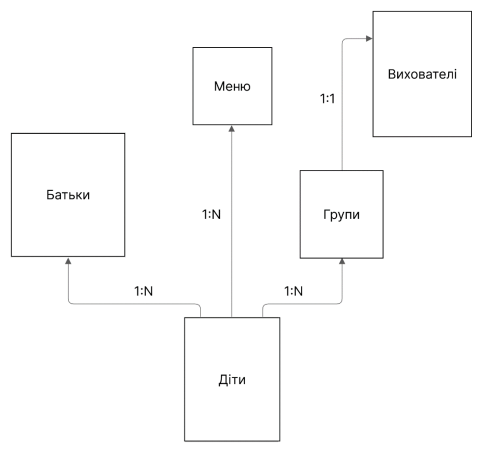
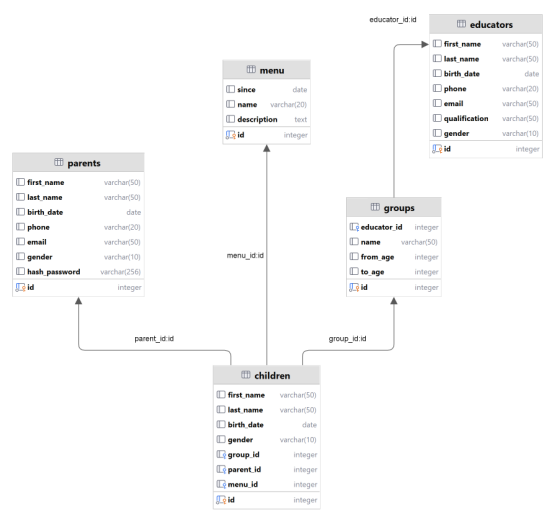
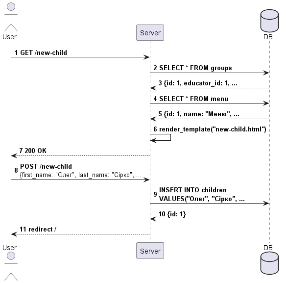
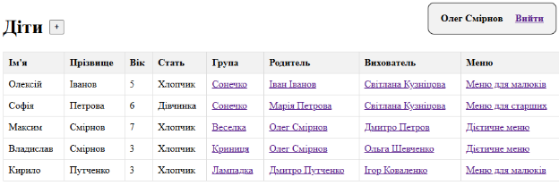
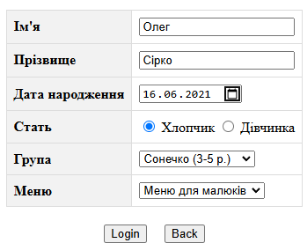
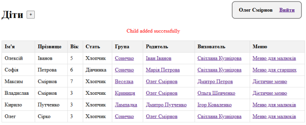

## Загальні відомості

Курсова робота з дисципліни "Бази даних".

Результатом роботи є ефективна база даних для автоматизації обліку інформації в дитячому садку. Це
дозволило систематизувати та оптимізувати процеси зберігання, пошуку та обробки даних про дітей, груп та вихователей, а
також забезпечило зручний доступ до цієї інформації через веб-інтерфейс.

## Логічне проектування

Оскільки метою є моделювання дитячого садка, його найважливішим об’єктом є дитина. Він має власні
властивості (наприклад, ім’я, стать), а також залежності від інших об’єктів – батьків та вихователей.

Але у дитини немає чіткого зв’язку з вихователем. Частіше, дітей збирають у групи, а вихователь стає її керівником.
Таким чином вдається створити систему більш гнучкою. Наприклад, якщо вихователь захворів, не потрібно назначати кожній
дитині, що є його опікуном, іншу людину. Достатньо внести зміни в дані групи.

Також, була створена можливість вибору меню для кожної дитини. Воно являє собою список страв, які дитина отримує
протягом дня.

## Фізичне проектування

Для реалізації бази даних було вибрано PostgreSQL 15.

## Демонстрація роботи додатка

Далі буде детально продемонстрована логіка додавання нової дитини до бази даних користувачем.

### Схематично

1. Клієнт робить запит до сервера за адресою /new-child;
2. Сервер робить запит до бази даних, щоб отримати інформацію про всі групи;
3. Дані про групи повертаються на сервер;
4. Сервер робить запит до бази даних, щоб отримати інформацію про всі меню;
5. Дані про меню повертаються на сервер;
6. Сервер створює динамічну сторінку, заповнюючи випадаючі списки отриманими групами та меню;
7. Контролер повертає html документ, що містить форму для введення інформації про дитину;
8. Родитель вводить необхідні дані та надсилає форму на сервер;
9. Дані зберігаються на сервері;
10. Сервер отримує id тільки що створеної дитини;
11. Клієнт отримує повідомлення про редірект на головну сторінку;

### Фактично

Тепер розглянемо, як цей процес виглядає зі сторони користувача. Спочатку родителю необхідно натиснути на кнопку «+» у
головному меню.

Далі він вводить дані дитини.

Після цього користувач може побачити, що його дитина була додана в базу даних.

## Додаткові посилання

[Курсова робота](https://drive.google.com/file/d/1YIf7AZMsh-amDwRZPbn9cO7D6ZS2m9Ae/view?usp=sharing)

[Робоча версія проекту](https://kindergarten.luxusxc.com)